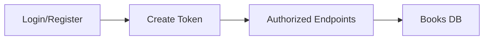

# API Server / Scraper

## Description
API Server to allow login and get, add, remove of books. 
Also contains selenium scraper to get books and store them in a DB
Includes SwaggerUI Docs

## Stack
- Python
- Sqlite
- FastAPI


## Setup
```
git clone https://github.com/hrudka-matt/apiserver
cd apiserver
python -m venv venv (start vm)
pip install -r requirements.txt
pip install uvicorn fastpi httpx pytest
--API Server
uvicorn main:app --reload

--Scraper
python scraper/reset_scrape.py
```
## DB

Uses SQLite (file path from `.env` via `BOOKS_DB_PATH`).


## API Map


